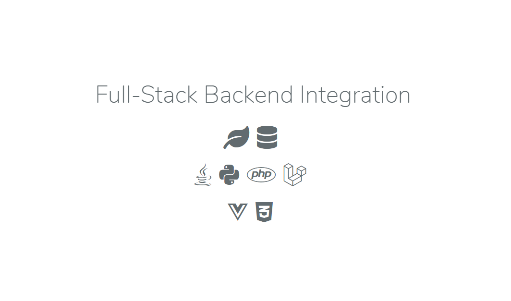

<p align="center"></p>

## About Project 📈

This will be an integration between various technologies for learning purpose, it would contain:
```
Database: MongoDB & MySQL
Backend: PHP & Laravel & Python & Java
Frontend: Vuejs & TailwindCSS
```

## The Idea 💡

Here it is all about integrating these backend technologies, Not about the product itself as i explained

> It is for LEARNING purpose

so, i will focus on:

```
* How to integrate 2 different kinds of DB in a project using Repository Design Pattern as a Trigger.
* How to call a script of a different language as Python or Java to process some data.
* How to implement Token Authorization using JWT.
and more more...
```
I will make a feature that user can Upload an image and add description for it.

🐍 the Python Script: will be for **Image-Manipulation** using [Pillow Library](https://github.com/python-pillow/Pillow).

☕ the Java Code: will be for text compression using **RLE Algorithm**.

## License

Feel free to use the code, it is open-sourced just for learning. ✌
